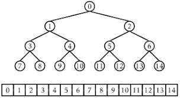

# Riempimenti di uno heap binario (bin\_heap\_fill)

Le $n$ celle di un array $A$ sono numerate da $0$ a $n-1$. Il _binary heap_ sovraimposto su $A$ guarda a tali celle come ai nodi di un _albero binario_ (ossia dove ogni nodo ha al massimo due figli) la cui radice è la cella $0$ ed ogni cella $i$ ha come suo _figlio sinistro_ la cella $2i+1$ e come suo _figlio destro_ la cella $2(i+1)$. Ovviamente non appena $2i+1$ e $2(i+1)$ dovessero eccedere $n-1$ il figlio in questione semplicemente non esiste.

I possibili collocamenti di $n$ valori numerici $x_0, \ldots, x_{n-1}$ entro le $n$ celle di $A$ sono $n!$ se gli $n$ valori da collocare sono tutti diversi, e  meno di $n!$ altrimenti. In particolare, vi è un solo modo di riempire $A$ qualora $x_0=x_1=\ldots=x_{n-1}$. Esso è dato da $A[i] = x_0$ per ogni $i=0,1,\ldots,n-1$.

Dato un sottoinsieme $E$ di $\{1,\ldots,n-1\}$, un collocamento $A$ è detto $E$_-buono_ se soddisfa la seguente proprietà:

> __heap-property(__$E$__):__ $A[i] \geq A[(i-1)/2]\,$ per ogni $i \in E$.

Nota: quando $E=\{1,\ldots,n-1\}$ la _heap-property_$(E)$ si traduce nella _classica proprietà di buon ordinamento di uno heap_ secondo cui il valore immagazzinato nel generico nodo $i$, $i>0$, non deve mai essere inferiore al valore immagazzinato nel rispettivo padre $((i-1)/2)$. (Questo garantisce che il valore collocato nella radice sia un minimo, cosa che viene sfruttata per reperire rapidamente la prossima cosa da fare in una Event Driven Simulation.)

Dato un collocamento iniziale $A$ ed un _insieme di posizioni fisse_ $F\subseteq \{0,1,\ldots,n-1\}$, un _ricollocamento $F$-stabile_ di $A$ è un collocamento $A'$ tale che $A'[i]=A[i]$ per ogni $i=0,1,\ldots,n-1$.

Sono due i diversi obiettivi generali che dovrai porti a seconda del subtask:

1. decidere se il collocamento iniziale $A$ assegnato sia $E$-buono;
2. decidere se esista un ricollocamento $F$-stabile di $A$ che sia $E$-buono.

A prescindere da quale dei due sia l'obiettivo dell'istanza, per praticità ti forniremo sempre e comunque un collocamento iniziale $A$, un insieme di posizioni fisse $F$, ed un _insieme di figli esuberanti_ $E$. 

## Input

Da `stdin` ricevi, nell'ordine:
1. il parametro $n$;
2. il parametro $t=1,2$ che specifica quale degli obiettivi menzionati sopra vada conseguito in questa istanza;
3. gli $n$ valori $x_0, \ldots, x_{n-1}$ forniti nell'ordine come disposti nel collocamento iniziale $A$;
4. una sequenza di $n$ valori $e_0, \ldots, e_{n-1}$ con $e_i \in \{0,1\}$ per $i=0,\ldots n-1$. Essi specificano $E$ nel senso che $i \in E$ se e solo se $e_i = 1$.
5. una sequenza di $n$ valori $f_0, \ldots, f_{n-1}$ con $f_i \in \{0,1\}$ per $i=0,\ldots n-1$. Essi specificano $F$ nel senso che $i \in F$ se e solo se $f_i = 1$. Per praticità ti forniremo questo dato in tutte le istanze, anche quelle dove $t=1$.

## Output

Il tuo programma deve scrivere su `stdout` quanto previsto a seconda dell'obiettivo:
- $t=1$: deve scrivere $1$ se il collocamento iniziale $A$ è $E$-buono, altrimenti deve scrivere $0$;
- $t=2$: deve scrivere $1$ se esiste un ricollocamento $F$-stabile di $A$ che sia $E$-buono, altrimenti deve scrivere $0$;

## Esempi

| input from stdin                                          | &nbsp;&nbsp;&nbsp;&nbsp; | output to stdout |
| ----------------                                          | ------------------------ | ---------------- |
| 7 1 2 3 1 5 4 7 6 0 1 1 1 1 1 1 0 0 0 0 0 0 0    | &nbsp;                   | 0                |
| &nbsp;                                                    | &nbsp;                   | &nbsp;           |
| 7 1 2 3 1 5 4 7 6 0 1 0 1 1 1 1 0 0 0 0 0 0 0    | &nbsp;                   | 1                |
| &nbsp;                                                    | &nbsp;                   | &nbsp;           |
| 7 2 2 3 1 5 4 7 6 0 1 1 1 1 1 1 0 0 0 0 0 0 0    | &nbsp;                   | 1                |
  &nbsp;                                                    | &nbsp;                   | &nbsp;           |
| 7 2 2 3 1 5 4 7 6 0 1 1 1 1 1 1 1 0 0 0 0 0 0    | &nbsp;                   | 0                |

## Spiegazione casi d'esempio

Nel primo caso, $n=7$ e $t=1$, quindi viene richiesto di controllare l'heap e potrei anche ignorare l'ultima riga (tutta di zeri). Il collocamento iniziale è quello che deve essere valutato. Esso ha posto il valore $1$ nel nodo $2$, e nel padre di questo, il nodo $0$, ha posto un valore più grande (un $2$). La risposta corretta è quindi $0$. Infatti _heap-property_$(\{2\})$ non è soddisfatta e $2\in E=\{1,\ldots,7\}$ come specificato nella seconda riga.  

Il secondo caso è identico al primo, eccetto che ora il nodo $2$ non appartiene ad $E$. Visto che ogni altro nodo $i$ soddisfa la proprietà _heap-property_$(\{i\})$, la risposta corretta è $1$. Di fatto il collocamento iniziale $A$ assegnato funge esso stesso da ricollocamento $E$-buono.

Il terzo caso è di nuovo identico al primo, eccetto che pone l'obiettivo di tipo $2$ (ora $t=2$, si veda il secondo numero della prima riga): si chiede ora se sia possibile riarrangiare gli elementi dello heap, mantenendo però fissi quelli nelle posizioni in $F$, in modo da ottenere un collocamento $E$-buono. Non avendo elementi in $F$ (si veda l'ultima riga interamente di zeri),  
siamo liberi di riarrangiare gli elementi in qualunque modo, e semplicemente scambiando i valori contenuti nei nodi $2$ e $0$ otteniamo un collocamento $E$-buono. Perciò la risposta corretta è $1$.

Il quarto caso è identico al terzo, eccetto che ora $F=\{0\}$. Non potendo spostare il valore $2$ dal nodo $0$ non è possibile ottenere uno heap $E$-buono, perciò la risposta corretta è $0$.

## Assunzioni

- $n$ è un numero intero compreso tra $0$ e $1\,000\,000$
- gli $n$ valori $x_0, \ldots, x_{n-1}$ sono tutti interi compresi tra $0$ e $10\,000\,000$
- garantiamo che il valore $e_0$ fornito in input (vedasi il punto $4$ della _Sezione Input_) valga sempre $0$ in ogni istanza da noi fornita

### Subtask
- **Subtask  0 [ 1 punto]**: risolvere correttamente i casi d'esempio quì sopra nel testo.
- **Subtask  1 [ 4 punti]**: $t=1$, $|F|=0$, $E=\{1,\ldots,n-1\}$.
- **Subtask  2 [ 4 punti]**: $t=1$, $|F|=0$, $E$ generico.
- **Subtask  3 [ 1 punti]**: $t=2$, $|F|=0$, $E=\{1,\ldots,n-1\}$.
---
- **Subtask  4 [5 punti]**: $t=2$, $|F|=1$, $E$ generico.
- **Subtask  5 [10 punti]**: $t=2$, $F$ è un _anticatena_ nel senso che in $F$ non sono mai presenti due nodi di cui uno è antenato dell'altro, $E$ generico.
---
- **Subtask  6 [25 punti]**: $t=2$, $F$ generico, $E=\{1,\ldots,n-1\}$, $n \leq 1\, 000$.
- **Subtask  7 [20 punti]**: $t=2$, $F$ generico, $E=\{1,\ldots,n-1\}$.
- **Subtask  8 [15 punti]**: $t=2$, $F$ generico, $E$ generico, $n \leq 1\, 000$.
- **Subtask  9 [15 punti]**: $t=2$, $F$ generico, $E$ generico.
