# Guida al setup del live streaming per l'esame di Algoritmi


Questa breve guida spiega come avviare uno streaming YouTube dal tuo PC per consentire un più completo controllo durante l'esame di Algoritmi.

Questo sistema è attualmente in sperimentazione e non obbligatorio, ma se lo attiverai seguendo i semplici passi quì esplicitati, questo ti garantirà un esame orale con meno domande e più snello e piacevole, se non la possibilità di saltarlo in toto (questo non credo sarà comunque il default al primissimo appello, ma potrai richiedere di saltare l'orale e nella maggior parte dei casi mi sarà possibile acconsentire).

Se le istruzioni nel presente documento ti sono poco chiare puoi chiedere aiuto e contribuire a migliorare od integrare le procedure come indicato in [Appendice 2](#appendice-chiedere-aiuto).

## Predisposizione di YouTube (almeno 30 ore prima dell'esame)

Un prerequisito necessario è avere un account google (o farne uno nuovo). In pratica con esso già disponi di un account YouTube, il chè già consente a YouTube di mantenere un profilo delle tue preferenze ed interessi se fruisci di video mentre loggato in google.
Se nel tuo account YouTube non disponi ancora di un tuo primo canale di base, con questa guida aprirai il tuo primo canale (e potrai poi sempre considerare di aggiungerne altri specifici ad argomenti sui quali puoi voler distribuire dei contenuti).
Con questo primo canale potrai finalmente creare e mantenere tu delle tue PlayList dei video da tè preferiti, che potrai eventualmente condividere, ed avrai accesso ad altre funzionalità che potrebbero venirti utili. Spero pertanto la lettura di questa guida possa rivelarsi interessante ed utile anche se infine non opterai per partecipare a questa sperimentazione intesa a ridurre i tempi necessari al tuo orale e le incognite ad esso associate.
Un leitmotif di YouTube è infatti che, mano a mano che avanzi nella tua carriera di YouTuber,
ti verrà data la possibilità di attivare delle funzionalità aggiuntive, alcune possono essere sbloccate da subito altre solo dopo aver raggiunto dei prerequisiti. Fortunatamente quelle che serviranno a noi sono tutte attivabili fin da subito.

Fin da quasi subito puoi ad esempio caricare su YouTube dei tuoi video già registrati, ma, per partecipare a questa sperimentazione, devi attivare la tua possibilità di inviare a YouTube i tuoi streaming. Questa è un'operazione che và fatta in due fasi e và predisposta per tempo, in quanto YouTube può prendere fino a 24 ore per l'attivazione di questa funzionalità.
La prima fase si conduce, provvisti di telefono per la conferma, dallo URL  https://www.youtube.com/live_dashboard_splash \
dove immetti la tua richiesta di essere abilitato allo streaming.
Se non hai già creato il tuo primo canale, non appena ti collegherai a tale URL ti verrà subito chiesto se desideri avere un tuo canale e con un solo click di conferma lo otterrai senza attese. Assicurati però anche di portare a termine la tua richiesta di abilitazione allo straming, dovebbe arrivarti una mail di conferma.

Una volta abilitato allo streaming (entro max 24 ore dalla tua richiesta) potrai ultimare l'attivazione e ti consigliamo anche di testare se e come ti sia ora possibile mandare dei brevi streaming di video+audio dal tuo PC verso YouTube.
Dopo aver fatto i tuoi primi test, crea subito ed imposta già ora su YouTube un nuovo streaming video,
con titolo e descrizione "Esame Algoritmi 2020-06-18 - Nome Cognome Matricola"
(variazioni sono da noi accettate, l'importante è che ci siano le informazioni di identificazione richieste).
Impostare quindi la Privacy a "Non in elenco" e visualizza e salvati la
chiave dello stream: essa ti sarà necessaria per avviarlo poco prima che cominci l'esame (perchè ne venga mantenuta registrazione lo stream potrà durare fino a 12 ore, quindi se preferisci puoi avviarlo anche con discreto anticipo, ci staremo dentro anche ove l'esame dovesse protrarsi oltre le 5 ore intese). 

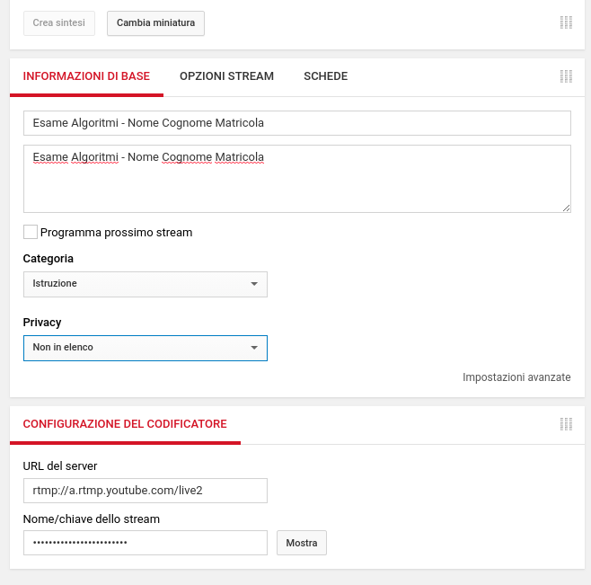</img>

Se vuoi evitarti di ripassare per il tuo account YouTube prima dell'esame salvati già ora, oltre che alla chiave di avvio, anche il link che serve per poter mettere in condivisione il tuo filmato:

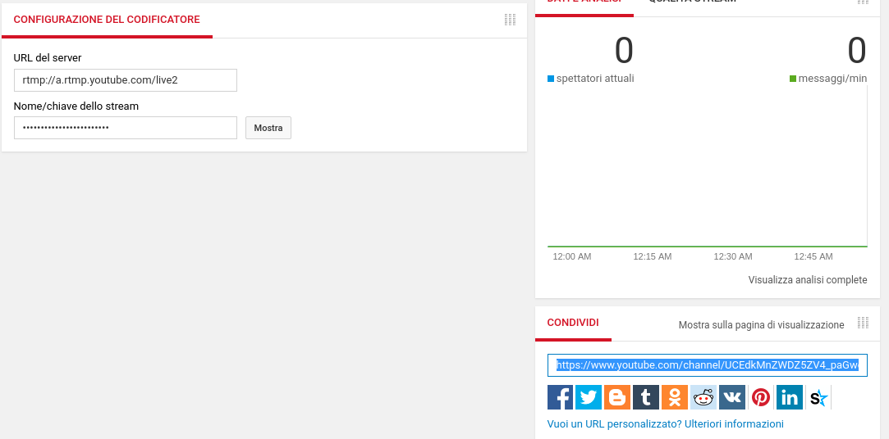</img>

Fatto? OK, allora per l'esame non hai più bisogno di ripassare per YouTube.
Dopo avere impostato lo streaming su YouTube puoi già inviarci la mail composta
<a href="mailto:romeo.rizzi@univr.it?cc=andrea.cracco@studenti.univr.it&subject=LINK%20ALLO%20STREAMING%20DEL%20MIO%20ESAME%20DI%20ALGORITMI&body=MATRICOLA:%20VR???%0d%0ANOME:%20???%0d%0ACOGNOME:%20???%0d%0ALINK:%20???%0d%0A
">utilizzando questo template</a>
e nel cui body avrai cura di inserire nome, cognome, matricola
ed il link di condivisione dello stream recuperato come da figura subito sopra. 
La mail può essere inviata nella settimana che precede l'esame, trovi maggiori dettagli ed un <a href="template_mail_builder/template_mail_invio_link_streaming.md">template esplicito</a> nell'[Appendice 1](#appendice-1) che conclude il presente documento.


## Installazione di OBS od altro software per l'emissione di uno stream dal tuo PC

Ti consigliamo di installarti OBS, un software gratuito, open source, multipiattafora (Windows, Mac, Linux, etc.) e standard de facto per la gestione degli stream. Merita comunque avercelo e serve nulla per imparare a gestirlo per un uso rudimentale ma già ricco di potenzialità come ad esempio serve a noi. Se hai o preferisci altri software per noi non è un problema, noi accederemo al tuo stream e alla sua registrazione da YouTube e quindi ci è indifferente. 
Ci limitiamo però a darti le istruzioni per il solo OBS, ovviamente basta condurre le operazioni analoghe se utilizzerai altri software (quindi prosegui comunque nella lettura o non sparai le operazioni che sei tenuto ad attuare).

Utilizzerai OBS per catturare lo schermo, il tuo audio (che all'esame ti è richiesto tenere attivo), e la webcam, ed inviare questo stream a YouTube che lo erogherà in stream al link che ci avrai fornito e nel contempo lo registrerà per controlli anche successivi (ti chiediamo di tenere il filmato sul tuo canale YouTube per almeno due settimane, in realtà YouTube ti consente di tenerlo a temo indefinto ma rimuoverlo sarà nostra cortesia come ringraziamento per il passaggio d'emergenza in autostop. Vi manderemo una mail per dirvi che, se lo desiderate, potete rimuovere i filmati).\
Per installare OBS da Linux è sufficiente dare i seguenti comandi da terminale:

```
 	sudo apt install ffmpeg
 	sudo add-apt-repository ppa:obsproject/obs-studio
 	sudo apt update
 	sudo apt install obs-studio
```
Altrimenti (se sei su altra piattaforma) ed in ogni caso trovi istruzioni esaustive e ottimi tutorial alla home del progetto OBS:\
\
https://obsproject.com/ 


Al primo avvio OBS vi chiederà di seguire il wizard di auto-configurazione (se non viene mostrato potete avviarlo dalla barra degli strumenti sotto il menù Strumenti):
scegliete l'ottimizzazione per lo streaming, con 30 FPS e la risoluzione dello schermo che avete.
Nelle informazioni dello stream inserite YouTube come server e come chiave quella ottenuta nel punto 1.

Una volta terminata questa fase di installazione e configurazione di OBS potrete a questo punto, prima di proseguire in questa guida, esplorare un minimo questo software potente e versatile per comprendere cosa possa consentirvi di fare ed i principi primi di uno streaming. Questo potrebbe aumentare le vostre motivazioni a saperne di più, cosa che concretizzeremo nella prossima sezione dove imposterai il primissimo streaming da tè erogato (e potremmo metterti il tuo primo Like).


## Erogazione dello streaming dal tuo PC

In realtà faremo anche qualcosa di più, poichè durante l'esame terrai innanzitutto attivo il collegamento su Zoom, come richiesto dall'ateneo e come ogni tuo compagno dovrà fare anche se deciderà di non partecipare a questa sperimentazione.
Di necessario chiediamo solo Zoom, senza SEB od altri sistemi suggeriti dall'ateneo che appesantirebbero di molto le vostre macchine e le procedure dell'esame senza per questo garantirci alcuna forma di garanzia o sicurezza in più. Non voglio perdere nessuno per il solo fatto che non ha un PC od una connessione abbastanza potente, e la sicurezza la costruiremo invece insieme perchè tutti vogliamo che l'esito dell'esame possa corrispondere alla preparaione acquisita.

Zoom + OBS dovrebbe invece comportare un carico sostenibile per i più di voi.
Chi dovesse avere una connessione al limite potrà decidere di astenersi da questa sperimentazione e limitarsi ad utiizzare solo Zoom, oppure, rilevando le difficoltà durante l'esame, potrà semplicmente spegnere OBS a quel punto.
La verifica che le competenze espresse all'esame sono farina del tuo sacco nel suo caso avverrà all'orale, nulla di compromesso.
Nessuno si troverà escluso dal poter condurre il suo esame per sole questioni tecniche. Chi non si trova rappresentato da questa affermazione mi contatti e cercheremo di capire meglio insieme quale sia la sua situazione e come ci si possa fare fronte (per altro esiste sempre la possibilità di aiutarmi in progetti e nella realizzazone di infrastrutture per questo od altri corsi, dove uno si trova comunque ad esprimere competenze non distanti da quelle che con l'esame devo certificarvi ed al tempo stesso può condurre un percorso di crescita anche autonomo e in competenze più ampie e trasversali).

## OBS - Setup della Scena
## <a name=”sezione_OBS”></a>
##### 0) Se non lo avete ancora fatto, create un meeting fittizio su Zoom e attivate la Webcam.
##### 1) Su OBS, nella categoria _Scenes_ cliccate sul **+**
##### 2) Date un nome alla scena e premete ok
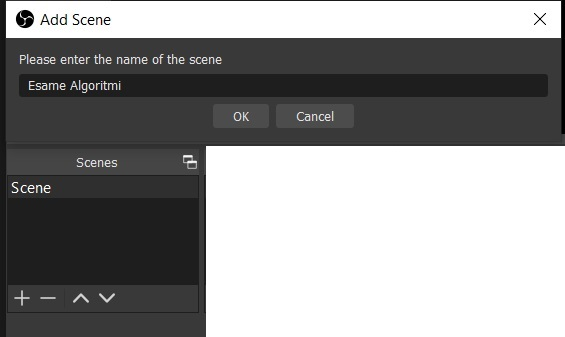<br>

##### 3) Adesso nella categoria _Sources_ cliccate sul **+**
##### 4) Selezionate *"Window Capture"* . Chiamatela *"Zoom Webcam"* o qualsiasi altro nome a vostra scelta.<br>
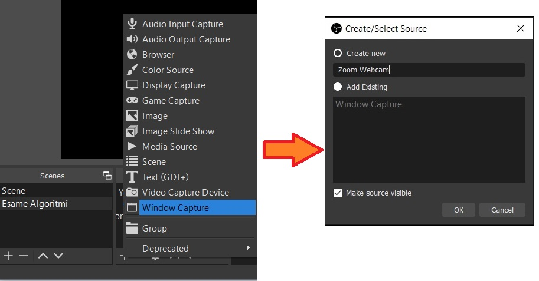<br>

##### 5) Nell'elenco delle finestre selezionate *"Zoom Meeting"* come in figura.
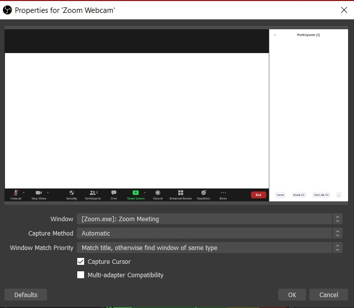<br>

##### 6) Se non vedete la vostra faccia, cambiate metodo di cattura.
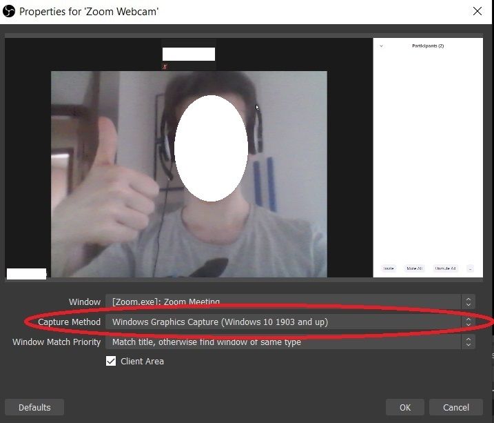<br>

##### 7) Ridimensionate la sorgente *"Zoom Webcam"* in modo che non occupi troppa parte di schermo.
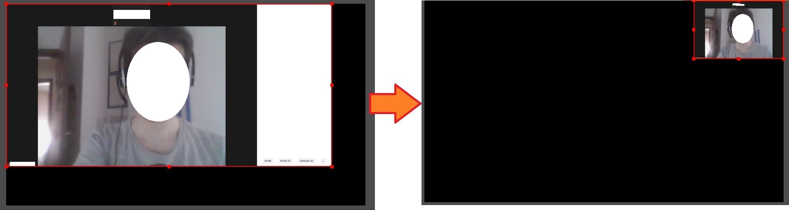<br>

##### 8) Adesso aggiungete una seconda _Source_ , l'intero schermo.
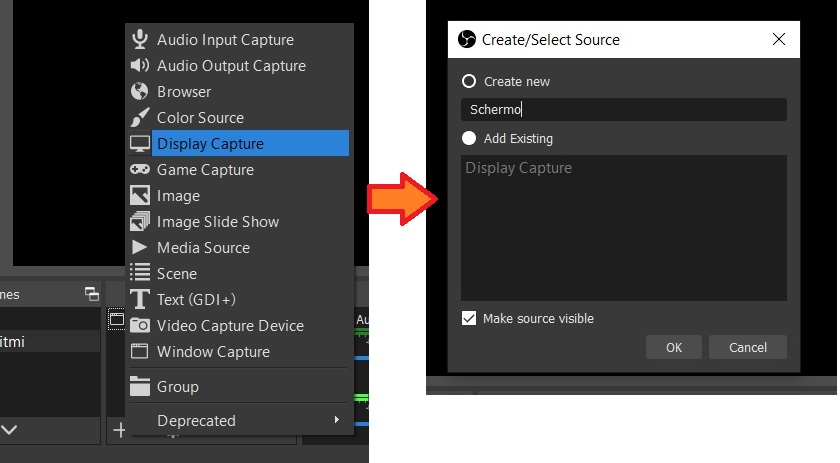<br>

##### 9) Eventualmente, riordinate le 2 sorgenti in modo che la webcam stia sopra
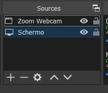<br>

##### A questo punto streammando dovreste ottenere una cosa del genere:
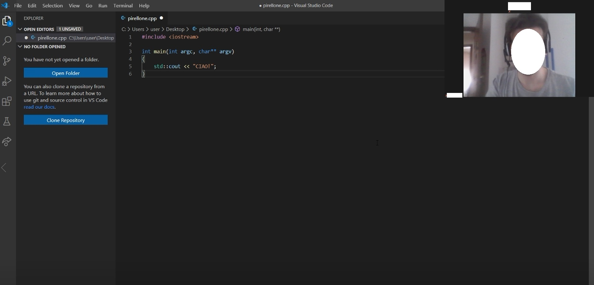<br>

### Regolazione Microfono (facoltativo)
Se il vostro stream ha tanto rumore di sottofondo e questa cosa vi da fastidio, potete impostare dei filtri cliccando sull'ingranaggio vicino al microfono e selezionando _filters_
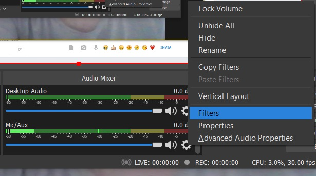<br>
Potrebbe fare al caso vostro il filtro *"Noise suppression"*
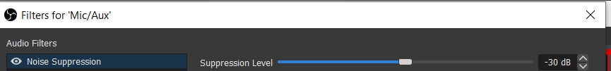<br>

### Pin del video durante l'esame
##### Per costringere Zoom a mostrare sempre in primo piano la vostra Webcam, durante l'esame dovrete:
##### - Cliccare col tasto destro sul vostro video
##### - Selezionare *"Pin Video"*
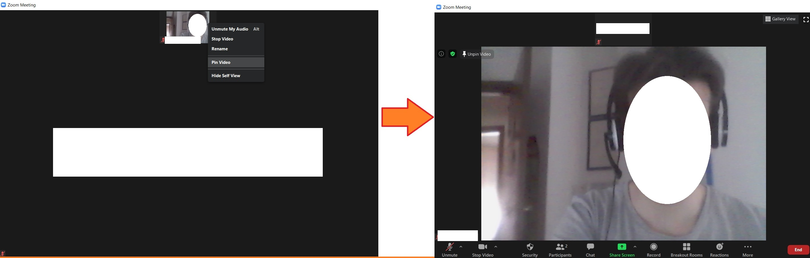<br>

### __Attenzione:__ non minimizzate la finestra di Zoom. Tenetela tranquillamente in secondo piano, ma non minimizzatela. Vi ricordiamo che siete tenuti a tenere attiva la webcam.

## Telegram - Selezione dei soli contatti necessari ai fini dell'esame

Sul tuo Desktop terrai attivi i soli servizi di messaggistica previsti da chi organizza l'esame.
Nel nostro caso sono previsti Zoom e Telegram.
Telegram in particolare è molto efficace per il mantenimento del contatto e di ogni coordinamento durante l'esame.
In ogni caso, in modo analogo a quanto descritto quì per Telegram, ti chiediamo di configure il servizio limitandolo
sia per ragioni di privacy (ogni tua interazione è registrata) che per rendere più facile la verifica che nessun abuso ha avuto luogo.

E' un fatto che Telegram dovrete averlo aperto dato che è lo strumento con cui ci teniamo allineati. Però può certo disturbarvi che nella registrazione finiscano i vostri contacts e le loro notifiche (privacy). Inoltre, è bene semplificare il controllo che non facciate un uso improprio degli strumenti di comunicazione.
Ecco quindi 3 regole. Situazioni particolari che richiedano la violazione di queste regole possono essere ammesse (magari dovete tenervi disponibili per un parente malato ... ) ma devono essere segnalate ed adeguatamente confinate come certo sarà possibile con l'intelligenza e collaborazione di tutti.

Regola 1: come strumento di comunicazione, oltre al Zoom per l'esame, tenete aperto solo Telegram, e lo screencast OBS in uscita su YouTube. __Spegnete il cellulare__ (se dovete rimanere rintracciabili avete Telegram sul Desktop).

Regola 2: dentro Telegram, silenziate eventuali notifiche per la durata dell'esame.

Regola 3: dentro Telgram, createvi un chat Folder apposito per l'esame: in tale folder predisponente solo 3 contatti:
1. il gruppo Algo2020 per le comunicazioni relative allo svolgimento dell'esame,
2. il mio contatto/chat e quello dei tutor per richieste di aiuto individuali piuttosto che collettive.

A livello di Telegram, cercate di rimanere entro tale chat folder per tutta la durata dell'esame.

Per come gestire i chat Folder trovi ulteriori istruzioni quì:
https://beebom.com/cool-telegram-messenger-tricks/

Se non li conosci ancora, i chat Folders sono una feature di cui ti varrà comunque la pena appropiarti per tenere ben organizzato il tuo spazio Telegram.
Per stare super tranquilli dovete anche disabilitare le eventuali notifiche desktop attive (Regola 2) altrimenti se su dei canali a notifica attiva vi arrivano dei messaggi durante l'esame, sullo schermo registrato compare la notifica con utente e preview del messaggio.
Chat folders + disabilitazione notifiche isola perfettamente le chat ed è una soluzione di facile implementazione.


## <a name=”appendice-1”></a> Appendice 1: format della mail con il link per l'accesso al tuo streaming del tuo esame di Algoritmi dal tuo PC

Qualora
<a href="mailto:romeo.rizzi@univr.it?cc=andrea.cracco@studenti.univr.it&subject=LINK%20ALLO%20STREAMING%20DEL%20MIO%20ESAME%20DI%20ALGORITMI&body=MATRICOLA:%20VR???%0d%0ANOME:%20???%0d%0ACOGNOME:%20???%0d%0ALINK:%20???%0d%0A
">questo link che ti abbiamo predisposto</a>
dovesse fallire nell'avviare una finestra del tuo mailer con una mail già correttamente preimpostata, eccoti allora quì riportato in esplicito un template per la mail che dovrai inviarci nel corso della settimana che precede l'esame (non più tardi del momento di avvio effettivo dell'esame stesso).


#### A CHI INVIARE LA MAIL COL LINK PER ACCEDERE ALLO STREAMING:
```
TO: romeo.rizzi@univr.it
CC: andrea.cracco@studenti.univr.it
```
---
#### SUBJECT DELLA MAIL:
```
LINK ALLO STREAMING DEL MIO ESAME DI ALGORITMI
```
---
#### BODY DElLA MAIL:
```
MATRICOLA: VR???
NOME: ???
COGNOME: ???
LINK: ???
```

Ovviamente i 4 campi contrassegnati da `???i???` per `i` in {`1`,`2`,`3`,`4`} sono quelli che dovrai personalizzare prima di procedere all'invio.

## <a name=”appendice-chiedere-aiuto”></a>Appendice 2: Chiedere aiuto, e aiutaci a migliorare il presente documento

Se delle cose non sono chiare non esitare a chiedere aiuto sul <a href="https://t.me/Algoritmi2020gruppo">Gruppo Telegram dell'edizione corrente del corso</a>.
Se hai delle segnalazioni o suggerimenti su come migliorare il presente documento non mancare di farcele avere anche privatamente.
Sempre graditissimi tuoi screenshot e/o domande puntuali e/o precisazioni da integrare in passaggi che reputi critici.

Infine, se hai delle buone idee su come migliorare questo sistema od altre soluzioni siamo curiosi di conoscerle e, ove la realizzazione richiedesse lavoro e comportasse un percorso potremo volentieri pensare ad un progetto collocabile come (tua) proposta entro il corso/spazio di Sfide o configurabile come stage. 
